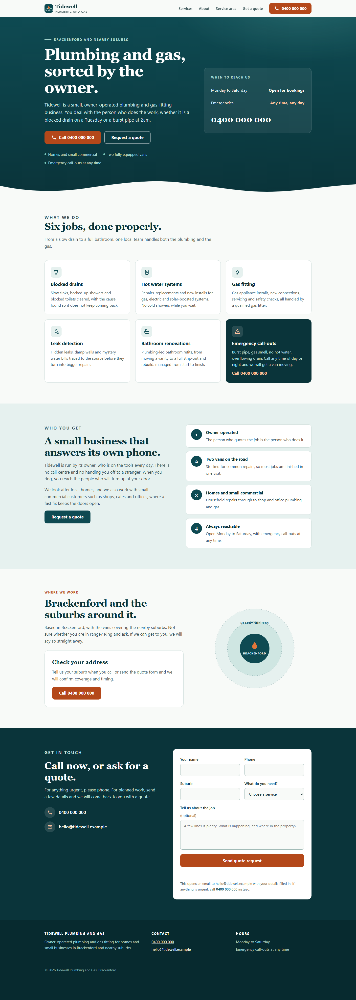
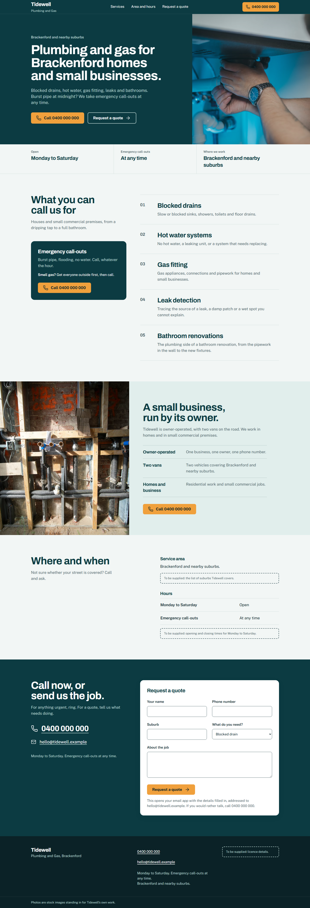

# UI Design Skill

A skill for Claude that plans, designs and builds a marketing website the way a careful designer would: it agrees a direction before building, uses real photos it has checked, and never invents facts about the business.

| Without the skill | With the skill |
|---|---|
|  |  |

The same brief, the same model. Both are the median result of three runs. [How the comparison was run, and where the skill made no difference](examples/comparison.md).

## What it makes Claude do

Ask for a website and the skill takes Claude through eight steps:

1. **Plan.** Who the page is for, the one action it should drive, the structure, palette and type.
2. **Direction checkpoint.** A short summary of the design, then "Build this, or change something?". Say "just build it" in your request to skip the wait.
3. **Build.** Mobile first, one spacing scale, one type scale, sections that vary in shape.
4. **Polish.** A second pass over alignment, rhythm, hover and focus states, and contrast.
5. **Media.** Photos from Unsplash and video from Pexels that fit the business. Every link is fetched and seen to load before it is used. If a link cannot be checked, a labelled placeholder goes in its place.
6. **Icons.** Lucide, one family, used with restraint.
7. **Motion.** The Motion library: short, purposeful animation that respects reduced motion.
8. **Final check.** Remove what makes a page look machine-made, and remove anything about the business that was not supplied.

It ends every build with a "Still needed from you" list: each placeholder on the page and what should replace it.

If you supply a logo, colours or a typeface, the skill treats them as fixed and builds around them.

## Install

**Claude Code**

```bash
git clone https://github.com/talha55/ui-design-skill ~/.claude/skills/ui-design-skill
```

**Claude on the web or desktop**

Download this repository as a zip file and add it as a custom skill in Claude's settings, under Skills.

The skill is a folder of Markdown files: `SKILL.md` and the eight files in `references/`. It has no scripts and no dependencies.

## Use

Ask for a site in your own words:

> Build a website for my bakery in Leith. We do sourdough and pastries, open Tuesday to Sunday. Here is our logo and our green.

> Redesign this landing page. Just build it, I trust your judgement.

In an existing React or Next.js project, the skill uses the project's own stack. With no project, it builds a single HTML file that opens in any browser.

## Libraries and sources it uses

- [Lucide](https://lucide.dev) for icons, and the [animated Lucide set](https://lucide-animated.com) in React projects.
- [Motion](https://motion.dev) for animation.
- [Unsplash](https://unsplash.com) for photos and [Pexels](https://www.pexels.com/videos/) for video.
- Tailwind CSS and Google Fonts when building a standalone page.

## Limits

- It is for marketing sites and landing pages. It is not for dashboards, internal tools or mobile apps.
- Results vary from run to run. The comparison shows the spread across three runs.
- Finding and checking photos needs web access. Without it, the skill uses labelled placeholders instead of photos.
- Photo links are checked when the page is built. They can stop working later, so replace stock photos with your own before launch.
- A build with the skill takes longer than one without, mostly because of the photo checks.
- Stock photos stand in for the business's own photos. The skill labels them as stock and never presents them as the business.

## Licence

MIT. See [LICENSE](LICENSE).
