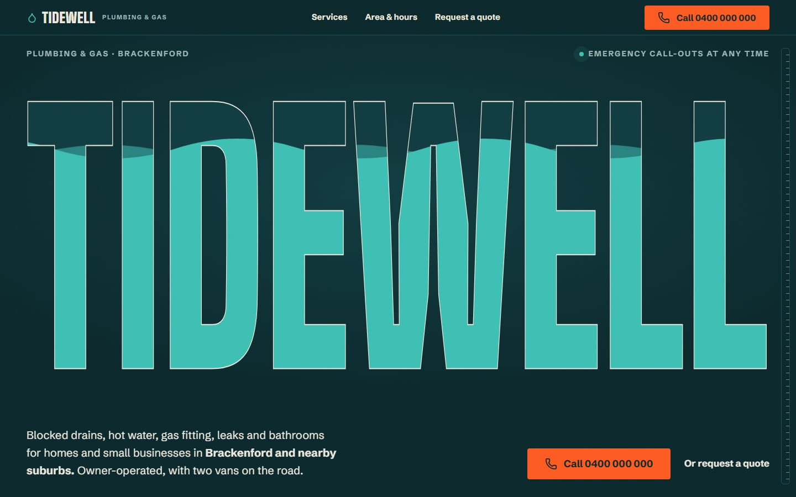
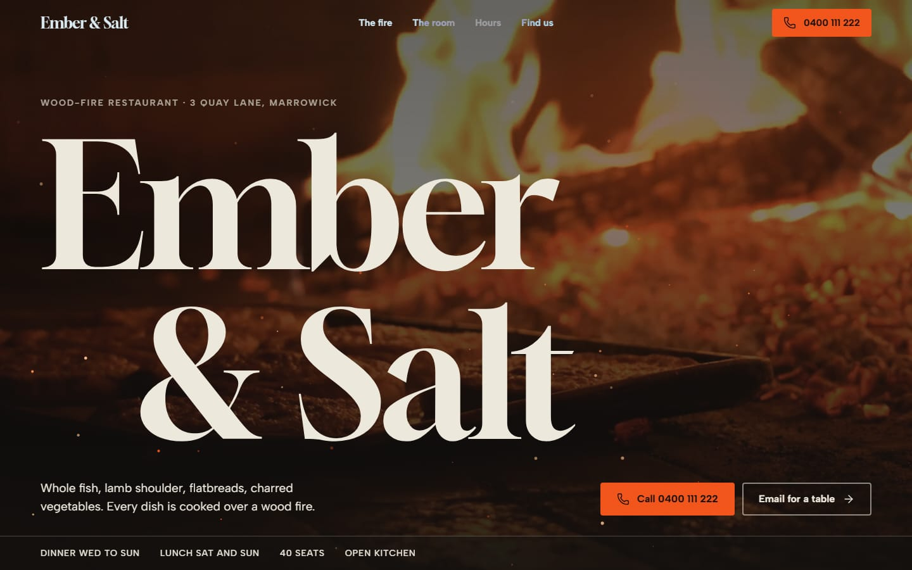
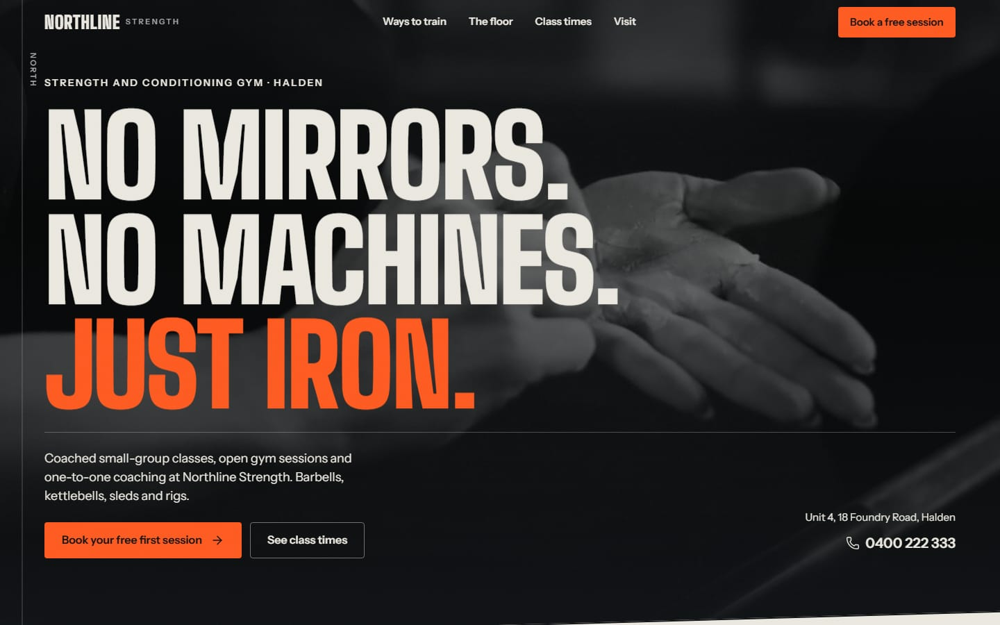
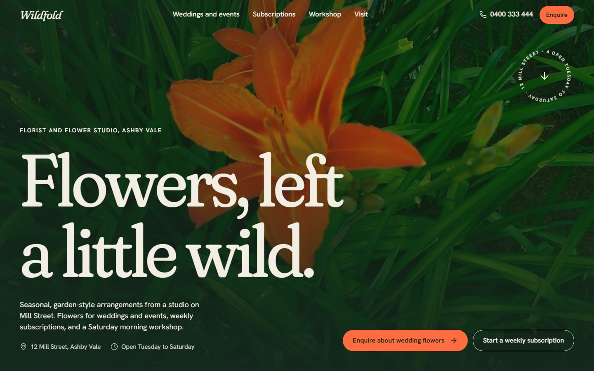

# UI Design Skill

A skill for Claude that designs and builds bold, animated marketing websites: one strong idea, choreographed scroll and pointer animation, real photos and video it has checked, and nothing invented about the business.

| | |
|---|---|
|  |  |
|  |  |

Four first screens, each built by Claude with this skill from a short written brief for an invented business. The motion does not show in a picture: open the pages in [examples/showcase](examples/showcase) in a browser and scroll.

## What each example does

- **[Plumbing](examples/showcase/plumbing/index.html).** The business name fills with water that tilts towards the pointer. A pinned scene opens a photo to full screen while the lines people say before they phone a plumber appear one at a time. Services are giant type rows with a photo that follows the cursor.
- **[Restaurant](examples/showcase/restaurant/index.html).** A full-screen fire video behind the name. A pinned scene steps through the four things the kitchen cooks, each under a huge heading.
- **[Gym](examples/showcase/gym/index.html).** A barbell loads plate by plate as you scroll while a giant number counts to eight, the class size. Class times run sideways as the page scrolls down. The page turns orange for the closing offer.
- **[Florist](examples/showcase/florist/index.html).** A garden video hero with a rotating badge, seasonal sections that arrive one after another, and editorial forms for weddings and subscriptions.

## What it makes Claude do

Ask for a website and the skill takes Claude through eight steps:

1. **Plan and art direction.** Who the page is for, the one action it should drive, and one big idea in one of four signatures: cinematic scroll, bold editorial, dark and vivid, or playful and kinetic.
2. **Direction checkpoint.** A short summary of the idea, palette, type, sections and the moments the page is built around, then "Build this, or change something?". Say "just build it" to skip the wait.
3. **Build.** Mobile first, display type at full scale, full-bleed media, overlapping layers, sections that each have a different shape.
4. **Polish.** Alignment, rhythm, hover and focus states, contrast.
5. **Media.** Photos from Unsplash and video from Pexels. Every link is fetched and seen to load before it is used. If one cannot be checked, a labelled placeholder goes in its place.
6. **Icons.** Lucide, one family.
7. **Motion.** A choreographed opening, a scroll story, a scroll-driven centrepiece, pointer response and an ending, built from a library of fourteen tested patterns using Motion and Lenis.
8. **Final check.** Would anyone say wow? Does anything look machine-made? Is anything about the business invented?

It ends every build with a "Still needed from you" list: each placeholder on the page and what should replace it.

If you supply a logo, colours or a typeface, the skill builds around them. If you ask for something simple or minimal, it holds back.

## Install

**Claude Code**

```bash
git clone https://github.com/talha55/ui-design-skill ~/.claude/skills/ui-design-skill
```

**Claude on the web or desktop**

Download this repository as a zip file and add it as a custom skill in Claude's settings, under Skills.

The skill is a folder of Markdown files: `SKILL.md` and the files in `references/`. It has no scripts and no dependencies.

## Use

Ask for a site in your own words:

> Build a website for my bakery in Leith. We do sourdough and pastries, open Tuesday to Sunday. Make it something people remember.

> Redesign this landing page. Just build it, I trust your judgement.

In an existing React or Next.js project, the skill uses the project's own stack. With no project, it builds a single HTML file that opens in any browser.

## Libraries and sources it uses

- [Motion](https://motion.dev) for animation and [Lenis](https://lenis.darkroom.engineering) for smooth scrolling.
- [Lucide](https://lucide.dev) for icons, and the [animated Lucide set](https://lucide-animated.com) in React projects.
- [Unsplash](https://unsplash.com) for photos and [Pexels](https://www.pexels.com/videos/) for video.
- Tailwind CSS and Google Fonts when building a standalone page.

## How it was tested

- **Version 1.0** was a careful, restrained skill. It was tested with three builds with and three without on the same brief, scored blind. [That comparison](examples/comparison.md) still stands for what it measured, but its screenshots show the older, quieter style.
- **Version 1.1** is the bold version shown above. The examples are single builds, not the best of several, and they were not scored. Before release, every photo and video link was checked to load, and each page was opened in a headless browser at desktop and phone widths to check for script errors and sideways scrolling.

## Limits

- It is for marketing sites and landing pages, not dashboards, internal tools or mobile apps.
- Results vary from run to run. The examples show typical results, not guaranteed ones.
- A bold build takes a long time, often 20 to 30 minutes, mostly spent finding and checking photos and video.
- Builds tend to reach for an orange accent and a heavy condensed typeface. The skill pushes against this, but not always successfully.
- Finding and checking media needs web access. Without it, the skill uses labelled placeholders.
- Media links are checked at build time and can stop working later. Replace stock media with the business's own before launch.
- Stock media stands in for the business's own photos and is labelled as stock on the page.

## Licence

MIT. See [LICENSE](LICENSE).

Built by [Talha Muneer](https://www.talhamuneer.com), a full-stack and AI engineer working with agencies and businesses in the United States, the United Kingdom, Australia and Europe. More of his work: [GitHub](https://github.com/talha55) and [case studies](https://github.com/talha55/case-studies).
